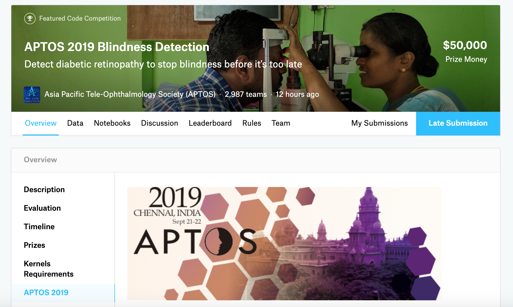

[APTOS 2019 Blindness Detection](https://www.kaggle.com/c/aptos2019-blindness-detection/overview/description)
---



## Description

Imagine being able to detect blindness before it happened.

Millions of people suffer from diabetic retinopathy, the leading cause of blindness among working aged adults. Aravind Eye Hospital in India hopes to detect and prevent this disease among people living in rural areas where medical screening is difficult to conduct. Successful entries in this competition will improve the hospital’s ability to identify potential patients. Further, the solutions will be spread to other Ophthalmologists through the 4th Asia Pacific Tele-Ophthalmology Society (APTOS) Symposium

Currently, Aravind technicians travel to these rural areas to capture images and then rely on highly trained doctors to review the images and provide diagnosis. Their goal is to scale their efforts through technology; to gain the ability to automatically screen images for disease and provide information on how severe the condition may be.

In this synchronous Kernels-only competition, you'll build a machine learning model to speed up disease detection. You’ll work with thousands of images collected in rural areas to help identify diabetic retinopathy automatically. If successful, you will not only help to prevent lifelong blindness, but these models may be used to detect other sorts of diseases in the future, like glaucoma and macular degeneration.

Get started today!

## Final Result

Bronze medal | Top 7% - 193/2987

I would love to thank [Claudio](https://www.linkedin.com/in/claudio-fanconi-b37904153/), my team mate in this project, for his great work! It was really a nice and fun team ;)

---

## [Data](https://www.kaggle.com/c/aptos2019-blindness-detection/data)

You are provided with a large set of retina images taken using fundus photography under a variety of imaging conditions.

A clinician has rated each image for the severity of diabetic retinopathy on a scale of 0 to 4:

```
0 - No DR

1 - Mild

2 - Moderate

3 - Severe

4 - Proliferative DR
```

Like any real-world data set, you will encounter noise in both the images and labels. Images may contain artifacts, be out of focus, underexposed, or overexposed. The images were gathered from multiple clinics using a variety of cameras over an extended period of time, which will introduce further variation.

### Files

In a synchronous Kernels-only competition, the files you can observe and download will be different than the private test set and sample submission. The files may have different ids, may be a different size, and may vary in other ways, depending on the problem. You should structure your code so that it returns predictions for the public test set images in the format specified by the public `sample_submission.csv`, but does not hard code aspects like the id or number of rows. When Kaggle runs your Kernel privately, it substitutes the private test set and sample submission in place of the public ones. You can plan on the private test set consisting of 20GB of data across 13,000 images (approximately).

Public vs Private

**train.csv** - the training labels

**test.csv** - the test set (you must predict the `diagnosis` value for these variables)

**sample_submission.csv** - a sample submission file in the correct format

**train.zip** - the training set images

**test.zip** - the public test set images

---

## Code

  - [Blending our Top3 Models and 2 Public - Final solution - PublicLB: 0.803, PrivateLB: 0.917](script/blending-kernel-top3-model-2-public.html)
  - [DenseNet Training '19 - '15 Data](script/aptos19-densenet-trained-with-old-and-new-data.html)
  - [DenseNet Inference '19 - '15 Data](script/aptos19-densenet-inference-old-new-data.html)
  - [EfficientNet Training '19 - '15 Data](script/aptos19-efficientnet-keras-regression-lb-0-75.html)
  - [EfficientNet Inference '19 - '15 Data](script/aptos19-inference-efficientnet-keras-regression.html)
  - [EfficientNet B3 Regression Model 1 by Claudio](script/efficientnetb3-regression-model-1.html)
  - [EfficientNet B3 Regression Model 2 by Claudio](script/efficientnetb3-regression-model-2.html)
  - [EfficientNet B3 Multi-Label Model 3 by Claudio](script/efficientnetb3-multilabel-model-3.html)
  - [Aptos2019 ImageSuperResolution](script/aptos2019-image-super-resolution.html)

